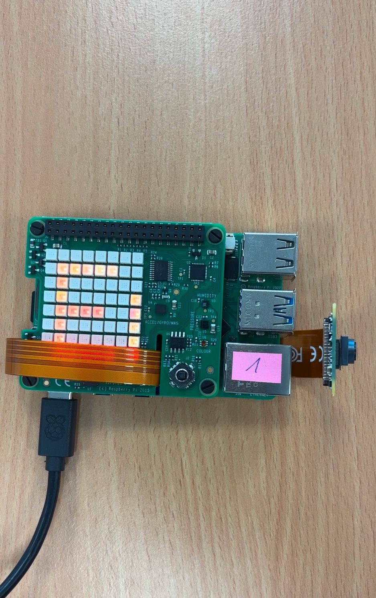
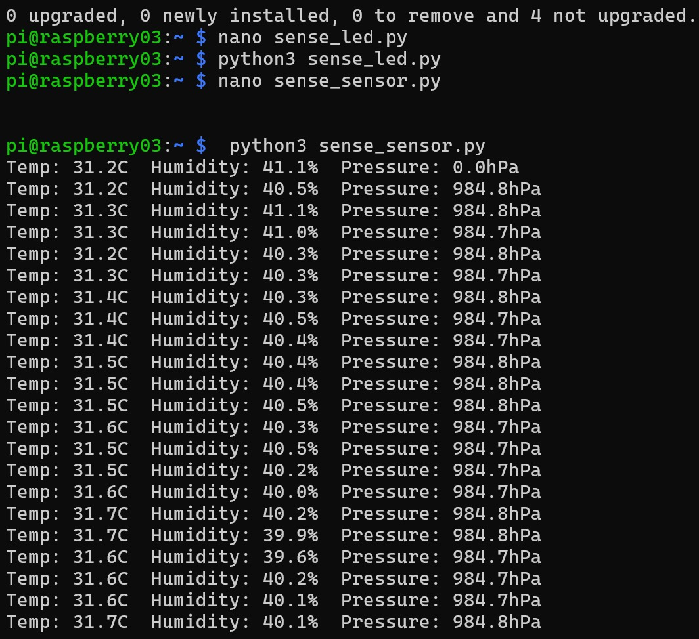

# Sensor-Interfacing-With-Rasberry-PI
## Introduction
In this lab we will use the Pi SensorHAT interfacing using the Raspberry Pi 5.
## Sample Images

## Instructions
1.Connect the Pi SenseHAT to the RaspBerryPi \
2.Connect to the Raspberry Pi using SSH \
3.Upload the code to the Pi using scp command \
4.Run the code to get the output

## Conclusion
This lab focused on sensor interfacing using the Raspberry Pi 5 and Sense HAT. The primary goals were to control the LED matrix to display messages and retrieve real-time environmental data (temperature, humidity, and pressure) using Python. These tasks are foundational for embedded AI and robotics applications.
